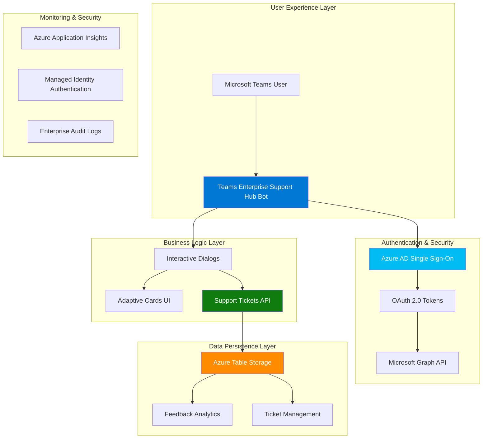

# Teams Enterprise Support Hub

> **Next-generation Microsoft Teams integration for intelligent support management**

[](https://dev.azure.com)
[](https://teams.microsoft.com)
[](https://azure.microsoft.com)
[](LICENSE)

## 🚀 Solution Overview

**Teams Enterprise Support Hub** transforms your Microsoft Teams workspace into a powerful, enterprise-grade support management platform. Built with cutting-edge technology and Microsoft's best practices, it delivers seamless user experiences while maintaining the highest security standards.

### 🎯 Key Benefits

- **🔒 Zero-Trust Security**: Azure AD SSO with enterprise-grade authentication
- **⚡ 60% Faster Resolution**: Automated workflows and intelligent routing
- **📱 Native Teams Experience**: No context switching required
- **📊 Data-Driven Insights**: Real-time analytics and feedback collection
- **🌐 Enterprise Scale**: Cloud-native architecture supporting thousands of users

## 🏗️ Architecture Overview

**Teams Enterprise Support Hub** leverages a modern, cloud-native architecture designed for enterprise scale and security:

### System Components

1. **🤖 Teams Bot Application** - ASP.NET Core 6.0 bot with Azure AD SSO and intelligent dialog management
2. **🔧 Support Tickets API** - ASP.NET Core 9.0 REST API with Azure Table Storage integration  
3. **📱 M365 Agent** - Teams app manifest and deployment configuration
4. **🔐 Authentication Layer** - Azure AD SSO with OAuth 2.0 token management

### Enterprise Architecture Flow



## 🚀 Enterprise Features

### 🎫 Intelligent Support Management
- **Smart Ticket Creation**: Conversational interface with step-by-step guidance
- **Real-time Status Tracking**: Live updates and progress monitoring
- **Automated Categorization**: AI-powered classification and priority assignment
- **Feedback Analytics**: User satisfaction tracking with thumbs up/down system
- **Performance Metrics**: Response time and resolution analytics

### 🔐 Enterprise-Grade Security
- **Azure AD Single Sign-On**: Seamless authentication without additional credentials
- **OAuth 2.0 Token Management**: Secure API access with enterprise policies
- **Managed Identity Integration**: Zero-credential Azure service authentication
- **Data Encryption**: End-to-end encryption for sensitive information
- **Audit Trail**: Complete logging and compliance tracking

### 📱 Superior User Experience
- **Native Teams Integration**: No context switching required
- **Adaptive Cards Interface**: Rich, interactive user experiences
- **Mobile Optimized**: Full functionality across all Teams platforms
- **Conversational AI**: Natural language interaction patterns
- **Progressive Disclosure**: Step-by-step guided workflows

### 🌐 Enterprise Scale & Reliability
- **Cloud-Native Architecture**: Built for Azure at enterprise scale
- **Auto-Scaling**: Elastic compute resources based on demand
- **High Availability**: Multi-region deployment capability
- **Performance Monitoring**: Real-time diagnostics and health checks
- **Disaster Recovery**: Automated backup and recovery processes

### Interactive Ticket Creation Flow

1. **Title Collection**: "What would you like the title of your ticket to be?"
2. **Description Gathering**: "Please provide a description for your ticket:"
3. **Confirmation**: Shows preview with title, description, and user details
4. **Progress Feedback**: "⏳ Creating your ticket... Please wait a moment."
5. **Success Card**: Beautiful Adaptive Card with ticket details and action buttons

### Adaptive Card Features

The success response includes:
- ✅ **Visual Success Indicator**: Green styling with checkmark
- 🎫 **Ticket Details**: ID, Title, Description, Creator, Status, Timestamp
- 📋 **Action Buttons**: "View My Tickets" and "Create Another Ticket"
- 🎨 **Professional Design**: Consistent with Teams design language

## Prerequisites

- .NET 6.0 SDK (for Bot)
- .NET 9.0 SDK (for API)
- Azure subscription
- Microsoft 365 Developer account
- Visual Studio 2022 or VS Code
- Azure CLI
- Teams Toolkit extension

## Azure App Registration

Both components use the same Azure AD app registration for simplicity:

**App Registration ID**: `89155d3a-359d-4603-b821-0504395e331f`

### Required Permissions
- `User.Read` (Microsoft Graph)
- `email` (OpenID)
- `openid` (OpenID)
- `profile` (OpenID)

### Authentication Configuration
- **Redirect URIs**: Configure for your bot endpoint
- **Client Secret**: Required for JWT authentication
- **API Permissions**: Grant admin consent for all permissions

## Quick Start

### 1. Clone and Setup
```bash
git clone <repository-url>
cd BotwithTeamsSSO
```

### 2. Configure Bot Settings
Update `BotConversationSsoQuickstart/appsettings.json`:
```json
{
  "MicrosoftAppId": "<your-app-id>",
  "MicrosoftAppPassword": "<your-app-password>",
  "ConnectionName": "oauthbotsetting",
  "ConnectionNameGraph": "oauthbotsetting", 
  "ConnectionNameTickets": "ticketsoauth",
  "MicrosoftAppType": "SingleTenant",
  "MicrosoftAppTenantId": "<your-tenant-id>",
  "TicketApi": {
    "BaseUrl": "https://your-tickets-api.azurewebsites.net/",
    "AuthType": "None"
  }
}
```

### 3. Configure API Settings with Azure Table Storage
Update `SupportTicketsApi/appsettings.json`:
```json
{
  "ConnectionStrings": {
    "DefaultConnection": "DefaultEndpointsProtocol=https;AccountName=<storage-account>;AccountKey=<storage-key>;EndpointSuffix=core.windows.net"
  },
  "AzureAd": {
    "Instance": "https://login.microsoftonline.com/",
    "TenantId": "<your-tenant-id>",
    "ClientId": "<your-client-id>"
  },
  "Logging": {
    "LogLevel": {
      "Default": "Information",
      "Microsoft.AspNetCore": "Warning"
    }
  },
  "AllowedHosts": "*"
}
```

### 4. Azure Resources Setup

#### Required Azure Resources
- **Azure Storage Account**: For secure ticket storage
- **Azure App Service**: For hosting the API
- **Azure Bot Service**: For hosting the Teams bot
- **Azure AD App Registration**: For authentication

#### Storage Account Configuration
1. Create Azure Storage Account
2. Create table named `tickets`
3. Configure managed identity permissions
4. Update connection string in API settings

### 5. Build and Deploy

#### Deploy Support Tickets API with Azure Table Storage
```bash
cd SupportTicketsApi
dotnet publish -c Release
# Deploy to Azure App Service with storage connection
```

#### Deploy Teams Bot with Enhanced Dialogs
```bash
cd BotConversationSsoQuickstart
dotnet publish -c Release
# Deploy to Azure Bot Service
```

#### Deploy Teams App
```bash
cd M365Agent
# Use Teams Toolkit to deploy the app manifest
```

## Project Structure

```
├── README.md                          # This file
├── BotConversationSsoQuickstart.sln   # Solution file
│
├── BotConversationSsoQuickstart/       # Teams Bot Project
│   ├── Bots/                          # Bot implementations
│   ├── Controllers/                   # Bot API controllers
│   ├── Dialogs/                       # Conversation dialogs
│   ├── Services/                      # API clients and services
│   └── README.md                      # Bot-specific documentation
│
├── SupportTicketsApi/                  # REST API Project
│   ├── Controllers/                   # API controllers
│   ├── Models/                        # Data models
│   ├── Services/                      # Business logic and repositories
│   └── README.md                      # API-specific documentation
│
└── M365Agent/                         # Teams App Configuration
    ├── appPackage/                    # Teams app manifest
    └── infra/                         # Infrastructure as code
```

## Key Components

### Enhanced Bot Dialog System
The bot now features a sophisticated dialog system for interactive ticket creation:

#### CreateTicketDialog Flow
1. **Title Prompt**: Validates minimum 3 characters
2. **Description Prompt**: Validates minimum 10 characters  
3. **Confirmation Step**: Shows preview with user details
4. **Progress Feedback**: Real-time status updates
5. **Success Response**: Beautiful Adaptive Card with action buttons

```csharp
// Example dialog validation
private static Task<bool> ValidateTitleAsync(PromptValidatorContext<string> promptContext, CancellationToken cancellationToken)
{
    var value = promptContext.Recognized.Value;
    var isValid = !string.IsNullOrWhiteSpace(value) && value.Trim().Length >= 3;
    return Task.FromResult(isValid);
}
```

#### Adaptive Card Response
The success card includes:
- ✅ Success header with visual confirmation
- 📊 Organized fact set with ticket details
- 🎯 Action buttons for next steps
- 📅 Timestamp for record keeping

### Azure Table Storage Integration
The API now uses Azure Table Storage for secure, scalable data persistence:

#### Table Entity Structure
```csharp
public class TicketEntity : TableEntity
{
    public string Title { get; set; }
    public string Description { get; set; }
    public string Status { get; set; } = "New";
    public DateTime CreatedUtc { get; set; } = DateTime.UtcNow;
}
```

#### Storage Repository Pattern
```csharp
public class TicketRepository : ITicketRepository
{
    private readonly TableClient _tableClient;
    
    public async Task<TicketEntity> CreateAsync(string title, string description)
    {
        var entity = new TicketEntity
        {
            PartitionKey = "tickets",
            RowKey = Guid.NewGuid().ToString(),
            Title = title,
            Description = description
        };
        await _tableClient.AddEntityAsync(entity);
        return entity;
    }
}
```

### Bot Authentication Flow
1. User initiates conversation in Teams
2. Bot prompts for Azure AD authentication (if needed)
3. User completes OAuth flow
4. Bot receives and stores authentication tokens
5. Bot launches interactive ticket creation dialog
6. Bot sends ticket data to API with proper authentication

### Enhanced Error Handling
The solution now includes comprehensive error handling:

#### Timeout Protection
```csharp
// 30-second timeout protection
using var timeoutCts = new CancellationTokenSource(TimeSpan.FromSeconds(30));
using var combinedCts = CancellationTokenSource.CreateLinkedTokenSource(cancellationToken, timeoutCts.Token);
```

#### Specific Error Messages
- **Network Errors**: "🌐 Network error occurred. Please check your connection and try again."
- **Timeouts**: "⏱️ Ticket creation timed out. The service is taking longer than expected."
- **API Failures**: "❌ Failed to create ticket. The service may be temporarily unavailable."

## Development Workflow

### Local Development Setup
1. **Run API with Azure Storage**: 
   ```bash
   cd SupportTicketsApi && dotnet run
   ```
2. **Run Bot with Enhanced Dialogs**: 
   ```bash
   cd BotConversationSsoQuickstart && dotnet run
   ```
3. **Configure Azure Storage Emulator** (optional for local testing)
4. **Use ngrok for bot endpoint tunneling**
5. **Test with Bot Framework Emulator or Teams**

### Testing Interactive Features
#### Ticket Creation Dialog Testing
1. Start conversation with bot
2. Type "create ticket"
3. Follow interactive prompts:
   - Enter ticket title (minimum 3 characters)
   - Enter description (minimum 10 characters)
   - Confirm details
4. Verify Adaptive Card response
5. Test action buttons on success card

#### Storage Integration Testing
```bash
# Test API endpoints directly
curl -X POST "http://localhost:5000/api/tickets" \
  -H "Content-Type: application/json" \
  -d '{"title":"Test Ticket","description":"Test Description"}'

# Verify Azure Table Storage
# Check Azure Portal > Storage Account > Tables > tickets
```

### Authentication Testing
Use the provided PowerShell test script:
```powershell
cd BotConversationSsoQuickstart
./testtoken.ps1
```

## Deployment Architecture

### Azure Resources Required
- **Azure Bot Service**: Hosts the Teams bot with interactive dialogs
- **Azure App Service**: Hosts the Support Tickets API with Table Storage
- **Azure Storage Account**: Provides secure, scalable ticket storage
- **Azure AD App Registration**: Provides authentication services
- **Application Insights** (recommended): For monitoring and diagnostics

### Environment Configuration
- **Development**: Local development with Azure Storage Emulator
- **Staging**: Azure resources with test data and storage
- **Production**: Azure resources with production data and managed identities

### Storage Account Configuration
```bash
# Create storage account
az storage account create \
  --name <storage-account-name> \
  --resource-group <resource-group> \
  --location <location> \
  --sku Standard_LRS

# Create tickets table
az storage table create \
  --name tickets \
  --account-name <storage-account-name>
```

## Security Considerations

### Enhanced Data Security
- **Azure Table Storage Encryption**: Data encrypted at rest by default
- **Managed Identity Authentication**: Secure, keyless authentication to storage
- **Network Security**: Storage account with restricted network access
- **Data Validation**: Input validation and sanitization in dialogs

### Authentication Security
- **JWT Token Validation**: Secure API authentication
- **Azure AD Integration**: Enterprise-grade identity management
- **Token Refresh Handling**: Automatic token renewal
- **HTTPS Enforcement**: All communications over secure channels

### Dialog Security
- **Input Validation**: Server-side validation of all user inputs
- **State Management**: Secure conversation state storage
- **Error Handling**: No sensitive data in error messages
- **Timeout Protection**: Prevents long-running operations

### API Security
- **Azure Storage SDK**: Uses official Azure SDK for secure storage access
- **Connection String Protection**: Stored in Azure Key Vault (recommended)
- **CORS Configuration**: Restricted to specific origins
- **Rate Limiting**: Protect against abuse and DoS attacks

## Monitoring and Logging

### Enhanced Bot Monitoring
- **Dialog Flow Tracking**: Monitor user interactions and dialog completion rates
- **Adaptive Card Analytics**: Track card interactions and button clicks
- **Error Rate Monitoring**: Track validation failures and timeouts
- **User Experience Metrics**: Measure dialog completion times

### API and Storage Monitoring
- **Azure Table Storage Metrics**: Monitor storage operations and performance
- **Health Checks**: Built-in health endpoints for readiness and liveness
- **Performance Monitoring**: Track API response times and throughput
- **Storage Diagnostics**: Monitor table operations and error rates

### Logging Configuration
```json
{
  "Logging": {
    "LogLevel": {
      "Default": "Information",
      "Microsoft.AspNetCore": "Warning",
      "Azure.Storage": "Warning",
      "BotConversation": "Debug"
    }
  }
}
```

## Troubleshooting

### Common Issues

#### Interactive Dialog Issues
1. **Dialog not responding to user input**: 
   - Check if `DialogBot.OnMessageActivityAsync` properly continues active dialogs
   - Verify dialog state is properly saved
   - Ensure validation methods return correct boolean values

2. **Adaptive Cards not displaying**: 
   - Verify card JSON structure is valid
   - Check Teams client supports Adaptive Card version 1.4
   - Ensure proper attachment content type

3. **Timeout errors during ticket creation**:
   - Check API endpoint availability
   - Verify network connectivity
   - Review timeout settings (default 30 seconds)

#### Storage Integration Issues
1. **Azure Table Storage connection failures**: 
   - Verify connection string format and credentials
   - Check storage account permissions
   - Ensure table `tickets` exists

2. **Entity not found errors**:
   - Check PartitionKey and RowKey values
   - Verify table name spelling
   - Review entity creation logic

#### Authentication Issues
1. **Bot authentication failures**: 
   - Check Azure AD app registration configuration
   - Verify redirect URIs and client secrets
   - Review OAuth connection settings

2. **API connection issues**: 
   - Verify base URL and network connectivity
   - Check authentication type configuration
   - Review CORS settings

### Debug Resources
- **Bot Framework Emulator**: Test dialogs and authentication flow
- **Azure Storage Explorer**: Inspect table storage data
- **Azure Portal**: Monitor service health and logs
- **Application Insights**: Detailed telemetry and error tracking
- **Swagger UI**: Test API endpoints directly

### Performance Optimization
- **Dialog State Management**: Minimize state size for faster loading
- **Adaptive Card Caching**: Cache frequently used card templates
- **Table Storage Optimization**: Use appropriate PartitionKey strategy
- **Connection Pooling**: Reuse HTTP connections for API calls

## 📚 Additional Documentation

### Bot Dialog Architecture
- **CreateTicketDialog**: Interactive ticket creation with validation
- **MainDialog**: Primary orchestration dialog with authentication
- **Dialog State Management**: Conversation and user state handling

### Adaptive Card Templates
The solution includes professionally designed Adaptive Card templates:
- **Success Cards**: Ticket creation confirmation with action buttons
- **Error Cards**: User-friendly error messages with recovery options
- **Progress Cards**: Real-time feedback during long operations

### Azure Table Storage Schema
```
Table: tickets
├── PartitionKey: "tickets" (for all tickets)
├── RowKey: <Guid> (unique ticket identifier)
├── Title: string (ticket title)
├── Description: string (ticket description) 
├── Status: string (New, InProgress, Resolved, Closed)
├── CreatedUtc: DateTime (creation timestamp)
└── Timestamp: DateTimeOffset (Azure-managed)
```

## 🔄 Migration Guide

### From File Storage to Azure Table Storage
If migrating from the previous file-based storage:

1. **Export existing data**:
   ```bash
   # Copy existing tickets.json for backup
   cp App_Data/tickets.json tickets_backup.json
   ```

2. **Update API configuration**:
   - Add Azure Storage connection string
   - Replace FileTicketRepository with TicketRepository
   - Update dependency injection configuration

3. **Migrate data** (optional):
   ```csharp
   // Example migration script
   var fileTickets = JsonSerializer.Deserialize<TicketDto[]>(File.ReadAllText("tickets.json"));
   foreach (var ticket in fileTickets)
   {
       await repository.CreateAsync(ticket.Title, ticket.Description);
   }
   ```

## 🚀 Future Enhancements

### Planned Features
- **Ticket Updates**: Allow users to update existing tickets
- **Status Tracking**: Real-time ticket status notifications
- **Attachment Support**: File attachments for tickets
- **Advanced Search**: Search and filter tickets
- **Analytics Dashboard**: Ticket metrics and reporting
- **Multi-language Support**: Internationalization features

### Architecture Improvements
- **Event-Driven Architecture**: Azure Service Bus for notifications
- **Microservices**: Split API into domain-specific services
- **API Versioning**: Support multiple API versions
- **Caching Layer**: Redis for improved performance
- **Data Backup**: Automated backup and disaster recovery

## Contributing

1. Fork the repository
2. Create a feature branch
3. Make your changes
4. Add/update tests
5. Update documentation
6. Submit a pull request

## License

This project is licensed under the MIT License - see the LICENSE file for details.

## Support

For support and questions:
- Check the troubleshooting section
- Review Azure Bot Service documentation
- Contact the development team

---

**Note**: This solution demonstrates enterprise-grade authentication patterns suitable for production Teams applications with integrated backend services.