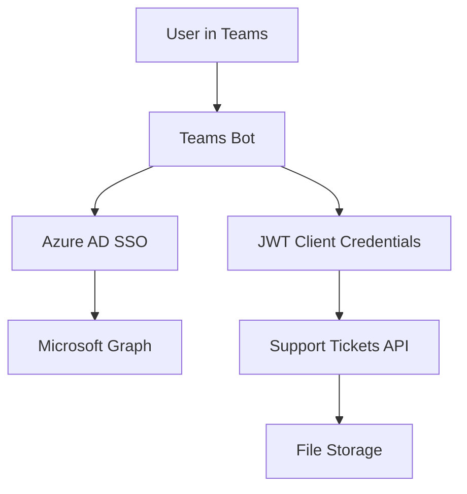

# Teams SSO with Support Tickets Solution

This solution demonstrates a comprehensive Teams Bot with Single Sign-On (SSO) authentication that integrates with a protected Support Tickets API. Users can authenticate using their Teams/Azure AD credentials and create support tickets that are stored securely.

## Architecture Overview

The solution consists of three main components:

1. **Teams Bot (BotConversationSsoQuickstart)** - ASP.NET Core 6.0 bot with Azure AD SSO
2. **Support Tickets API (SupportTicketsApi)** - ASP.NET Core 9.0 REST API with JWT authentication
3. **M365 Agent** - Teams app manifest and configuration

### Authentication Flow

The solution implements a dual authentication architecture:

1. **Teams SSO Authentication**: Users authenticate with their Teams/Azure AD credentials to access Microsoft Graph
2. **JWT Client Credentials**: The bot authenticates with the Support Tickets API using JWT tokens



## Features

### Teams Bot Features
- ✅ Single Sign-On with Azure AD
- ✅ Microsoft Graph integration (user profile, email)
- ✅ Real user identification (extracts actual Teams user names)
- ✅ Support ticket creation with authenticated API calls
- ✅ Token management and refresh
- ✅ Graceful error handling and logout

### Support Tickets API Features
- ✅ JWT Bearer token authentication
- ✅ CRUD operations for support tickets
- ✅ File-based storage with thread safety
- ✅ CORS enabled for cross-origin requests
- ✅ Swagger/OpenAPI documentation
- ✅ Health checks and monitoring

## Prerequisites

- .NET 6.0 SDK (for Bot)
- .NET 9.0 SDK (for API)
- Azure subscription
- Microsoft 365 Developer account
- Visual Studio 2022 or VS Code
- Azure CLI
- Teams Toolkit extension

## Azure App Registration

Both components use the same Azure AD app registration for simplicity:

**App Registration ID**: `89155d3a-359d-4603-b821-0504395e331f`

### Required Permissions
- `User.Read` (Microsoft Graph)
- `email` (OpenID)
- `openid` (OpenID)
- `profile` (OpenID)

### Authentication Configuration
- **Redirect URIs**: Configure for your bot endpoint
- **Client Secret**: Required for JWT authentication
- **API Permissions**: Grant admin consent for all permissions

## Quick Start

### 1. Clone and Setup
```bash
git clone <repository-url>
cd BotwithTeamsSSO
```

### 2. Configure Bot Settings
Update `BotConversationSsoQuickstart/appsettings.json`:
```json
{
  "MicrosoftAppType": "MultiTenant",
  "MicrosoftAppId": "89155d3a-359d-4603-b821-0504395e331f",
  "MicrosoftAppPassword": "<your-app-password>",
  "MicrosoftAppTenantId": "<your-tenant-id>",
  "ConnectionName": "BotConversationSsoQuickstart",
  "SupportTicketsApiBaseUrl": "https://your-api-url.azurewebsites.net"
}
```

### 3. Configure API Settings
Update `SupportTicketsApi/appsettings.json`:
```json
{
  "AzureAd": {
    "Instance": "https://login.microsoftonline.com/",
    "TenantId": "<your-tenant-id>",
    "ClientId": "89155d3a-359d-4603-b821-0504395e331f",
    "Audience": "89155d3a-359d-4603-b821-0504395e331f"
  }
}
```

### 4. Build and Deploy

#### Deploy Support Tickets API
```bash
cd SupportTicketsApi
dotnet publish -c Release
# Deploy to Azure App Service
```

#### Deploy Teams Bot
```bash
cd BotConversationSsoQuickstart
dotnet publish -c Release
# Deploy to Azure Bot Service
```

#### Deploy Teams App
```bash
cd M365Agent
# Use Teams Toolkit to deploy the app manifest
```

## Project Structure

```
├── README.md                          # This file
├── BotConversationSsoQuickstart.sln   # Solution file
│
├── BotConversationSsoQuickstart/       # Teams Bot Project
│   ├── Bots/                          # Bot implementations
│   ├── Controllers/                   # Bot API controllers
│   ├── Dialogs/                       # Conversation dialogs
│   ├── Services/                      # API clients and services
│   └── README.md                      # Bot-specific documentation
│
├── SupportTicketsApi/                  # REST API Project
│   ├── Controllers/                   # API controllers
│   ├── Models/                        # Data models
│   ├── Services/                      # Business logic and repositories
│   └── README.md                      # API-specific documentation
│
└── M365Agent/                         # Teams App Configuration
    ├── appPackage/                    # Teams app manifest
    └── infra/                         # Infrastructure as code
```

## Key Components

### Bot Authentication Flow
1. User initiates conversation in Teams
2. Bot prompts for Azure AD authentication
3. User completes OAuth flow
4. Bot receives and stores authentication tokens
5. Bot can access Microsoft Graph and call protected APIs

### API Authentication Flow
1. Bot obtains client credentials JWT token
2. Bot includes Bearer token in API requests
3. API validates JWT token with Azure AD
4. API processes requests if token is valid

### User Information Extraction
The bot extracts real user information from Teams context:
```csharp
var userName = step.Context.Activity.From.Name ?? "Unknown User";
var userEmail = step.Context.Activity.From.AadObjectId; // Used for identification
```

## Development Workflow

### Local Development
1. Run API locally: `cd SupportTicketsApi && dotnet run`
2. Run Bot locally: `cd BotConversationSsoQuickstart && dotnet run`
3. Use ngrok for bot endpoint tunneling
4. Test with Bot Framework Emulator or Teams

### Testing Authentication
Use the provided PowerShell test script:
```powershell
cd BotConversationSsoQuickstart
./testtoken.ps1
```

## Deployment Architecture

### Azure Resources Required
- **Azure Bot Service**: Hosts the Teams bot
- **Azure App Service**: Hosts the Support Tickets API
- **Azure AD App Registration**: Provides authentication
- **Azure Storage** (optional): For enhanced file storage

### Environment Configuration
- **Development**: Local development with ngrok
- **Staging**: Azure resources with test data
- **Production**: Azure resources with production data

## Monitoring and Logging

### Bot Monitoring
- Application Insights integration
- Bot Framework Analytics
- Custom telemetry in dialogs

### API Monitoring
- Built-in health checks at `/health`
- Application Insights logging
- Request/response logging

## Security Considerations

### Authentication Security
- JWT tokens with short expiration
- Secure token storage in bot state
- HTTPS enforcement for all communications

### API Security
- JWT Bearer token validation
- CORS configuration for specific origins
- Input validation and sanitization

### Data Protection
- User data stored securely
- Minimal data collection principle
- Proper token refresh handling

## Troubleshooting

### Common Issues
1. **Authentication failures**: Check app registration configuration
2. **API connection issues**: Verify base URL and network connectivity
3. **Token expiration**: Implement proper token refresh logic
4. **CORS errors**: Configure API CORS settings correctly

### Debug Resources
- Bot Framework Emulator for local testing
- Azure Portal for service monitoring
- Application Insights for detailed logging
- Swagger UI for API testing

## Contributing

1. Fork the repository
2. Create a feature branch
3. Make your changes
4. Add/update tests
5. Update documentation
6. Submit a pull request

## License

This project is licensed under the MIT License - see the LICENSE file for details.

## Support

For support and questions:
- Check the troubleshooting section
- Review Azure Bot Service documentation
- Contact the development team

---

**Note**: This solution demonstrates enterprise-grade authentication patterns suitable for production Teams applications with integrated backend services.