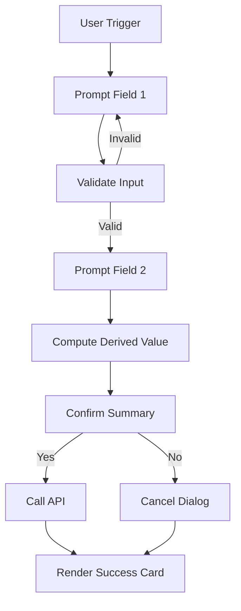

# Use Cases & Scenarios Guide
## Real-World Patterns for Accelerated Teams API Integrations

This guide supplies industry-specific scenarios, dialog flow patterns, payload structures, and expansion strategies so you can pitch, design, and implement integrations rapidly.

---
## 🔍 Scenario Index
| Code | Category | Scenario | Complexity | Primary Pattern |
|------|----------|----------|------------|-----------------|
| FIN-EXP-01 | Finance | Expense Submission & Approval | Medium | Multi-Step Workflow |
| FIN-PO-02 | Finance | Purchase Order Request | High | Branching Workflow |
| HR-LV-01 | HR | Leave / PTO Request | Low | Simple CRUD |
| HR-ONB-02 | HR | New Hire Onboarding Checklist | Medium | Integration Hub |
| IT-TKT-01 | IT Ops | Incident Ticket Creation | Low | Simple CRUD + Session Tracking |
| IT-DEP-02 | IT Ops | Deployment Approval | High | Multi-Stage Approval |
| MFG-MNT-01 | Manufacturing | Maintenance Request | Low | Simple CRUD |
| MFG-EQP-02 | Manufacturing | Equipment Status Query | Medium | Read-Only Dashboard |
| RET-INV-01 | Retail | Inventory Lookup | Low | Read-Only Lookup |
| RET-SCH-02 | Retail | Shift Swap Request | Medium | Multi-Step Validation |
| CRM-LEAD-01 | Sales/CRM | Lead Creation | Low | Simple CRUD |
| CRM-CUST-02 | Sales/CRM | Customer Account Overview | Medium | Aggregated Read |
| GOV-PERM-01 | Government | Permit Application Intake | High | Document Collection Workflow |
| HLTH-SHIFT-01 | Healthcare | Clinical Shift Assignment | Medium | Branching Validation |
| HLTH-PAT-02 | Healthcare | Patient Snapshot Retrieval | High | Aggregated Read + Security Controls |

---
## 🧩 Pattern Mapping
| Pattern | Description | Best For | Examples |
|---------|-------------|----------|----------|
| Simple CRUD | Collect basic fields → create or list | Single resource creation | HR Leave, Maintenance Request, Lead Creation |
| Multi-Step Workflow | Sequential prompts with validation | Processes requiring confirmation | Expense Submission, Deployment Approval |
| Branching Workflow | Dialog forks based on input | Decision trees / approvals | Purchase Order, Shift Swap |
| Read-Only Dashboard | Query + format response | Status / summary views | Equipment Status, Patient Snapshot |
| Integration Hub | Calls multiple APIs in one flow | Cross-domain data | New Hire Onboarding, Account Overview |
| Aggregated Read | Fan-out + consolidate response | Composite views | Customer Account Overview, Patient Snapshot |
| Document Collection | Validate attachments + metadata | Intake processes | Permit Application, Onboarding |

---
## 📘 Scenario Deep Dives
### 1. Finance: Expense Submission & Approval (FIN-EXP-01)
Goal: Employee submits an expense claim; manager approves.
Flow:
```
User → Trigger: "submit expense"
  1. Prompt: Expense category (dropdown options)
  2. Prompt: Amount (numeric validation)
  3. Prompt: Description (text)
  4. Optional: Receipt upload (Adaptive Card file consent)
  5. Confirmation summary
  6. API call: POST /api/expenses
  7. Return: Expense ID + pending status
  8. (Later) Manager receives proactive approval card
```
Key Fields:
| Field | Type | Validation |
|-------|------|-----------|
| Category | Enum | Must be in allowed set |
| Amount | Decimal | > 0; < organizational limit |
| Currency | String | Match locale or company standard |
| Description | String | Length < 500 |
| ReceiptUrl | String? | Optional; validate extension |

Dialog Considerations:
- Use `NumberPrompt` for amount
- Add `ConfirmPrompt` before submit
- Save `SessionInfo.Messages` to build audit trail

Expansion Roadmap:
- Add cost center lookup (secondary API call)
- Add policy violation warnings (pre-submit)
- Add duplicate detection (recent similar submissions)

---
### 2. HR: Leave Request (HR-LV-01)
Goal: Employee requests time off.
Minimal Flow:
```
User → "request leave"
  1. Prompt: Start date
  2. Prompt: End date
  3. Prompt: Leave type
  4. Show computed duration
  5. Confirm + submit
```
Validation:
- End ≥ Start
- Duration ≤ policy allowance
- Overlap check (optional API fetch)

API Call:
`POST /api/leaveRequests { startDate, endDate, type, session }`

Enhancements:
- Manager approval via proactive card
- Calendar conflict warnings
- Balance preview (`GET /api/leaveBalance`)

---
### 3. IT Ops: Deployment Approval (IT-DEP-02)
Problem: Manual approvals slow down releases.
Flow:
```
Dev triggers: "approve deployment"
  1. Prompt: Environment (Dev/Staging/Prod)
  2. Prompt: Change ticket ID
  3. Prompt: Risk level (Low/Medium/High)
  4. Conditional: If High → require justification
  5. Confirm summary
  6. Submit approval request
  7. Proactive notify approver(s)
```
Conditional Branching:
- Risk = High → Add extra prompt(s)
- Missing ticket ID → validation loop

Security:
- Role-based: validate user claim contains `DeploymentApprover`

Multi-API Integration:
- Change ticket system
- Deployment pipeline trigger API
- Notification service (webhook or Graph API for Teams card)

---
### 4. Retail: Inventory Lookup (RET-INV-01)
Goal: Provide real-time product stock.
Flow:
```
User: "inventory for ABC123"
  1. Prompt: SKU (or accept initial utterance)
  2. Optional: Location/Store ID
  3. Query API
  4. Show Adaptive Card with stock levels
```
API Call:
`GET /api/inventory/{sku}?location={storeId}`

Performance Tips:
- Cache frequent SKUs (memory or distributed cache)
- Throttle repeated queries (avoid API flood)

Card Layout:
| Store | On Hand | Reserved | Available |
|-------|---------|----------|-----------|

---
### 5. CRM: Lead Creation (CRM-LEAD-01)
Goal: Sales rep captures lead during call.
Flow:
```
User: "create lead"
  1. Prompt: Company name
  2. Prompt: Contact email (regex validation)
  3. Prompt: Lead source (dropdown)
  4. Optional: Notes
  5. Confirm + submit
  6. Response: Lead ID + next action buttons
```
Adaptive Card Action Buttons:
- View Lead → deep link URL
- Add Task → trigger task creation dialog
- Qualify Lead → start qualification process

Field Validation:
| Field | Rule |
|-------|------|
| Email | Must match pattern; check disposables |
| Source | Must map to CRM enum |
| Notes | Optional; sanitize |

---
### 6. Healthcare: Patient Snapshot (HLTH-PAT-02)
Goal: Clinician requests unified patient overview.
Flow:
```
User: "patient summary 998877"
  1. Validate access rights (claims check)
  2. Query multiple systems (EHR, lab results, meds)
  3. Aggregate response
  4. Render Adaptive Card with sections
```
Security Controls:
- Mask sensitive fields if role lacks privileges
- Log access in audit channel

Card Sections:
- Demographics
- Active Medications
- Last Lab Results
- Upcoming Appointments

Compliance:
- NEVER store full snapshot in bot state
- Only ephemeral display

---
## 🧠 Dialog Design Patterns
| Challenge | Pattern | Example |
|----------|---------|---------|
| Conditional prompts | Branch inside Waterfall | Deployment risk justification |
| Complex validation | Custom `PromptValidatorContext` | Email format + domain allowlist |
| Dynamic choices | API fetch before prompt | Cost center list in expenses |
| Re-entry after failure | `ReplaceDialogAsync` | Restart on repeated invalid inputs |
| Multi-resource outcome | Parallel API calls | Patient snapshot aggregation |
| Proactive follow-up | Store conversation ref | Approval notifications |
| Retry transient API | Polly + exponential backoff | Inventory service spike |

---
## 🧪 Sample Multi-Step Workflow (Mermaid)


---
## 🧪 Adaptive Card Fragment Example
```json
{
  "$schema": "https://adaptivecards.io/schemas/adaptive-card.json",
  "type": "AdaptiveCard",
  "version": "1.5",
  "body": [
    { "type": "TextBlock", "text": "Expense Submitted", "weight": "Bolder", "size": "Large" },
    { "type": "FactSet", "facts": [
      { "title": "Category", "value": "Travel" },
      { "title": "Amount", "value": "$428.50" },
      { "title": "Status", "value": "Pending Approval" }
    ]}
  ],
  "actions": [
    { "type": "Action.OpenUrl", "title": "View in Portal", "url": "https://portal.example.com/expenses/123" },
    { "type": "Action.Submit", "title": "Create Another", "data": { "action": "createAnother" } }
  ]
}
```

---
## 📦 Payload Design Examples
### Expense Submission Request
```json
{
  "category": "Travel",
  "amount": 428.50,
  "currency": "USD",
  "description": "Flight to NYC client meeting",
  "receiptUrl": "https://storage.example.com/rcpt/abc.png",
  "session": { "conversationId": "19:abc@thread.v2", "sessionId": "guid", "messages": [/*...*/] }
}
```

### Inventory Lookup Response
```json
{
  "sku": "ABC123",
  "locations": [
    { "storeId": "1001", "onHand": 53, "reserved": 10, "available": 43 },
    { "storeId": "1002", "onHand": 12, "reserved": 2, "available": 10 }
  ],
  "lastUpdated": "2025-11-24T18:22:11Z"
}
```

### Patient Snapshot Response (De-Identified Structure)
```json
{
  "patientId": "998877",
  "demographics": { "age": 54, "gender": "F" },
  "medications": [ { "name": "Atorvastatin", "dose": "10mg" } ],
  "labs": [ { "test": "HbA1c", "value": 6.1, "unit": "%" } ],
  "appointments": [ { "date": "2025-12-03", "type": "Cardiology" } ],
  "securityLevel": "Standard",
  "session": { "sessionId": "guid", "messageCount": 5 }
}
```

---
## 🔐 Security & Compliance Matrix
| Scenario | Data Sensitivity | Extra Controls |
|----------|------------------|----------------|
| Expense | Low | Basic token validation |
| Leave Request | Medium | Audit logging for approvals |
| Deployment Approval | Medium | Role claim required |
| Inventory Lookup | Low | Rate limit high-frequency SKUs |
| Patient Snapshot | High | Field masking + access log + no persistence |
| Permit Application | High | Document encryption + integrity hashes |

---
## 🧪 Testing Strategy per Scenario
| Scenario | Focus Tests | Edge Cases |
|----------|------------|-----------|
| Expense Submission | Numeric validation + receipt handling | Max amount, missing receipt |
| Leave Request | Date math, overlap detection | DST transition, leap year |
| Deployment Approval | Role claim check, branch path | High-risk justification missing |
| Inventory Lookup | Performance under rapid queries | SKU not found, network retry |
| Patient Snapshot | Access denial, masked fields | Unauthorized user, partial API failure |
| Lead Creation | Email validator, duplicate detection | Invalid domain, existing match |

---
## 📈 Scaling Strategy
| Dimension | Approach |
|----------|----------|
| More APIs | One client class per domain (HR/Finance/etc.) |
| Higher Load | Add caching layer + async fan-out |
| More Dialogs | Keep flows atomic, avoid monolith dialogs |
| Telemetry | Add correlation IDs per sessionId |
| Auditing | Centralize session exports nightly |
| Globalization | Localize prompt strings via resource files |

---
## 🚀 Scenario Implementation Starter Commands
```powershell
# 1. Create API client file
ni .\BotConversationSsoQuickstart\Services\ExpenseApiClient.cs

# 2. Add dialog skeleton
ni .\BotConversationSsoQuickstart\Dialogs\SubmitExpenseDialog.cs

# 3. Open solution
start BotConversationSsoQuickstart.sln

# 4. Run bot
cd BotConversationSsoQuickstart
dotnet run
```

---
## 🧠 Reuse Recommendations
| Existing Component | Reuse For |
|--------------------|-----------|
| `TicketApiClient` Session models | All scenarios needing audit trail |
| `CreateTicketDialog` pattern | Any simple create operation |
| OAuth dual pattern | All custom API + Graph combos |
| Error handling/logging | All API clients |

---
## 🎯 Quick Win Scenarios (Deploy First)
| Scenario | Reason |
|----------|--------|
| Lead Creation | Immediate sales impact |
| Leave Request | High employee visibility |
| Expense Submission | Finance process improvement |
| Inventory Lookup | Retail productivity boost |
| Incident Ticket | IT ops standardization |

Start with one low-complexity + one medium to demonstrate breadth.

---
## 🛠 Roadmap Example (Quarter Plan)
| Week | Milestone |
|------|-----------|
| 1 | Lead Creation + Leave Request live |
| 2 | Expense Submission (with receipts) |
| 3 | Inventory Lookup + basic caching |
| 4 | Deployment Approval (branching) |
| 5 | Patient Snapshot (pilot) |
| 6 | Observability + correlation improvements |
| 7 | Proactive notifications for approvals |
| 8 | Integration hub consolidation (cross-domain summary) |

---
## 🧾 Approval Workflow Card (Adaptive Card Sample)
```json
{
  "type": "AdaptiveCard",
  "version": "1.5",
  "body": [
    { "type": "TextBlock", "text": "Deployment Approval Request", "weight": "Bolder", "size": "Medium" },
    { "type": "FactSet", "facts": [
      { "title": "Environment", "value": "Production" },
      { "title": "Ticket", "value": "CHG-4421" },
      { "title": "Risk", "value": "High" }
    ]},
    { "type": "TextBlock", "text": "Justification:", "weight": "Bolder", "spacing": "Medium" },
    { "type": "TextBlock", "text": "Critical hotfix for payment service." }
  ],
  "actions": [
    { "type": "Action.Submit", "title": "Approve", "data": { "action": "approve", "ticket": "CHG-4421" } },
    { "type": "Action.Submit", "title": "Reject", "data": { "action": "reject", "ticket": "CHG-4421" } }
  ]
}
```

---
## 🧠 Conversation Design Tips
| Tip | Impact |
|-----|--------|
| Keep early flows < 5 prompts | Avoid user fatigue |
| Summarize inputs before submit | Reduce mistakes |
| Provide escape path ("cancel") | User trust |
| Use confirmation for destructive actions | Safety |
| Add suggested actions (buttons) | Faster interaction |
| Localize key prompts | Global adoption |

---
## ✅ Completion Definition per Scenario
A scenario is PRODUCTION-READY when:
- Dialog covers happy + failure paths
- Validation rules enforced
- API client handles non-200 responses gracefully
- SessionInfo persisted or logged as designed
- Security roles confirmed (where applicable)
- Observability events emitted (start/end/error)
- Documentation snippet added (internal wiki)

---
## 🏁 Summary
This guide equips you to:
- Select high-impact scenarios quickly
- Map each to a dialog + API pattern
- Implement reusable components efficiently
- Scale from single integration to multi-domain hub

Start small, iterate fast, expand strategically.

Use this as a living playbook—add rows, refine patterns, and drive consistent delivery velocity across teams.

---
## 📌 Next Step Suggestion
Pick ONE low-complexity (e.g., Lead Creation) + ONE medium (Expense Submission) scenario and implement both this week to showcase range.
